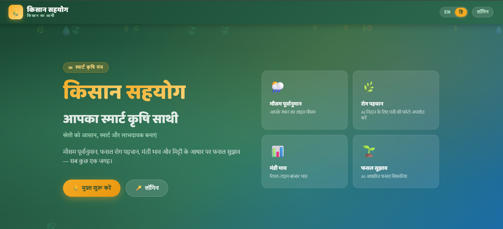
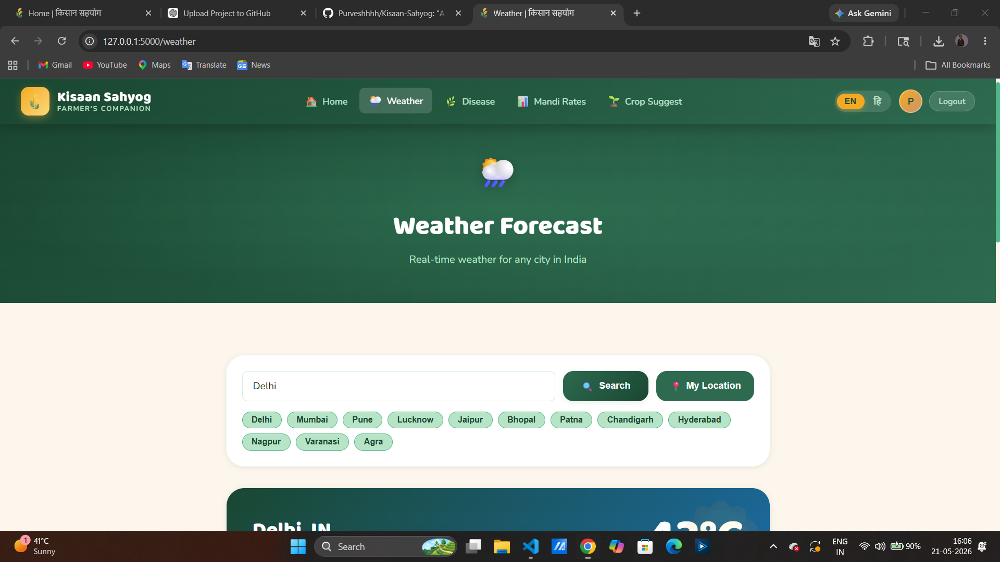
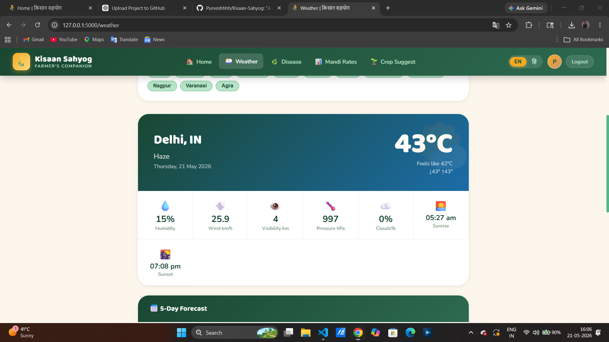
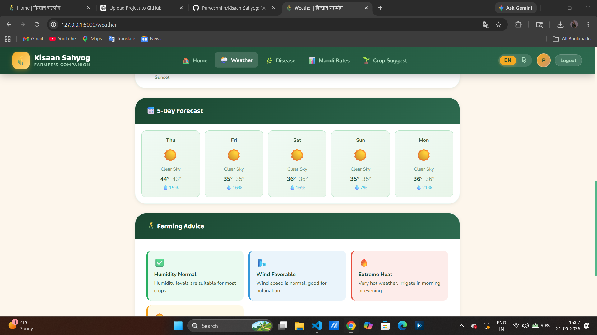
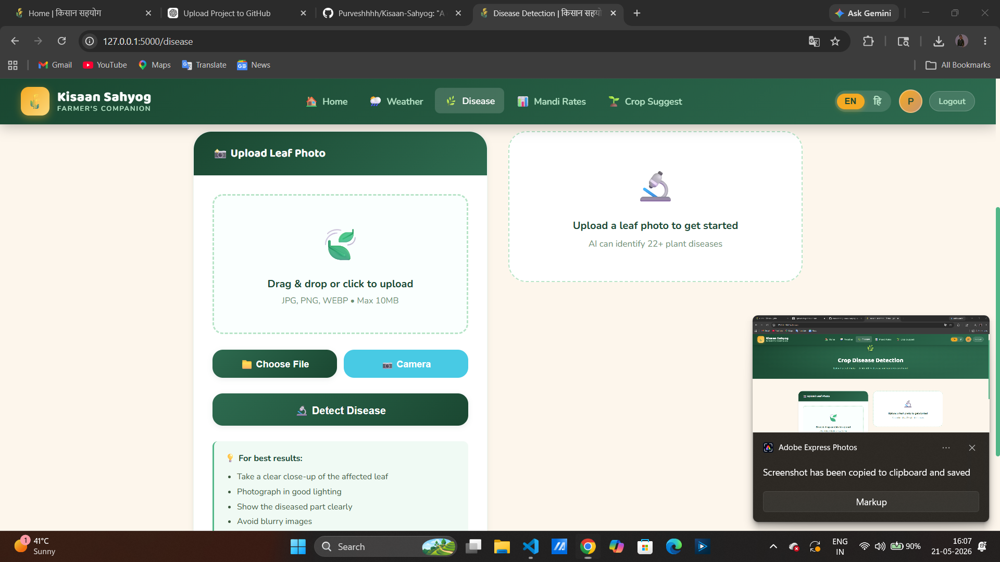
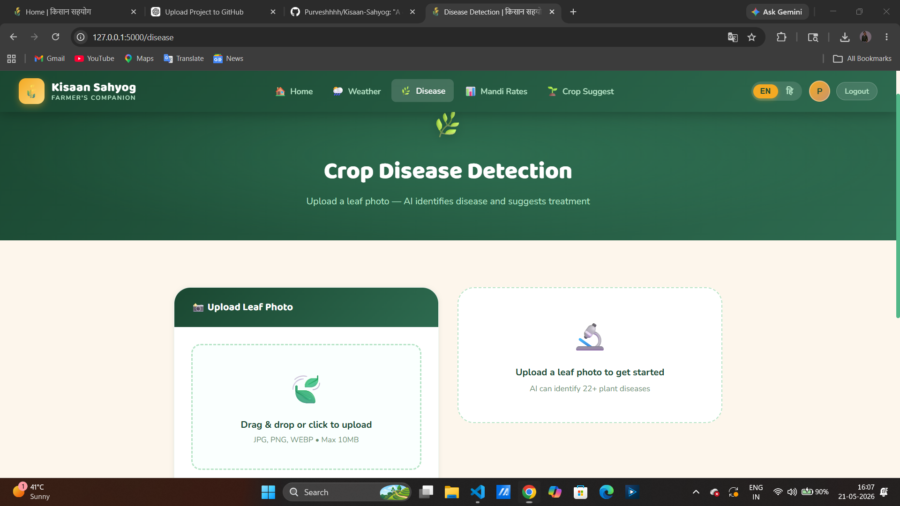

# Kisaan-Sahyog
"A digital companion of farmers ."

Kisaan Sahyog is a farmer-friendly web application built using Flask, Python, HTML, CSS, and JavaScript.  
The platform helps farmers with smart agriculture solutions like weather forecasting, crop recommendation, mandi rates, and plant disease detection.

---

## 🚀 Features

- 🌦️ Real-time Weather Forecast
- 🌱 Crop Recommendation System
- 🦠 Plant Disease Detection using AI/API
- 📈 Live Mandi Rates
- 🔐 User Authentication (Login/Register)
- 🌐 Farmer Friendly UI
- 📱 Responsive Design

---

## 🛠️ Technologies Used

### Frontend
- HTML5
- CSS3
- JavaScript

### Backend
- Python
- Flask

### Database
- SQLite

### Machine Learning / APIs
- Crop Recommendation Model
- Weather API
- Plant Disease Detection API

---

## 📂 Project Structure

KISAAN SAHYOG/
│
├── app.py
├── config.py
├── models.py
├── requirements.txt
├── README.md
├── .gitignore
├── .env
│
├── ml/
│   ├── crop_model.pkl
│   └── ...
│
├── routes/
│   ├── crop_routes.py
│   ├── disease_routes.py
│   ├── mandi_routes.py
│   └── weather_routes.py
│
├── static/
│   ├── css/
│   │   └── style.css
│   │
│   ├── js/
│   │   └── main.js
│   │
│   └── uploads/
│
├── templates/
│   ├── base.html
│   ├── index.html
│   └── ...
│
└── instance/
---

## ⚙️ Installation

### 1️⃣ Clone Repository

```bash
git clone https://github.com/Purveshhhh/Kisaan-Sahyog.git
```

### 2️⃣ Move to Project Folder

```bash
cd Kisaan-Sahyog
```

### 3️⃣ Create Virtual Environment

```bash
python -m venv venv
```

### 4️⃣ Activate Virtual Environment

#### Windows

```bash
venv\Scripts\activate
```

### 5️⃣ Install Dependencies

```bash
pip install -r requirements.txt
```

### 6️⃣ Run Application

```bash
python app.py
```

---

## 📸 Screenshots

### 🏠 Home Page


---

### 🔐 Login Page


---

### 🌦️ Weather Forecast



---

### 🌱 Crop Recommendation


---

### 🦠 Disease Detection


---

## 🔮 Future Improvements

- AI Chatbot for Farmers
- Soil Analysis
- Voice Support in Hindi
- Government Scheme Information
- Market Price Prediction

---

## 👨‍💻 Developed By

**Purvesh Gurjar**

---

## 📜 License

This project is for educational and learning purposes.